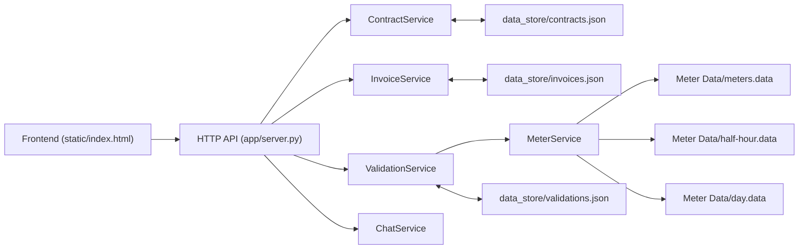
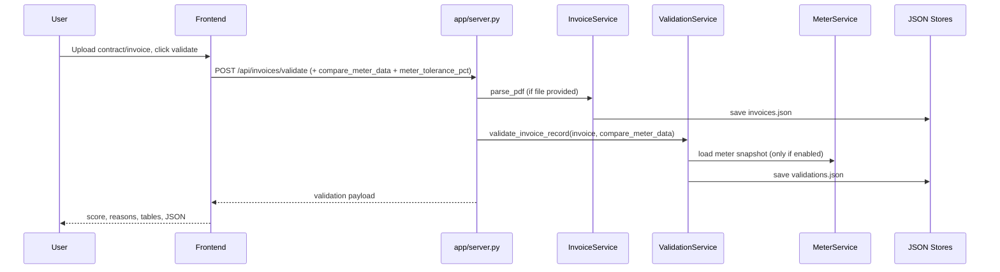

# Invoice Validation Tool - System Context (V1)

## 1) Purpose
This project is a **local-first utility-invoice validation POC**.  
It lets a user upload contracts (Excel) and invoices (PDF), validates invoice charges by MPAN against contract + optional meter data, and provides a grounded chatbot over extracted evidence.

This document is written to onboard both:
- Human developers
- AI coding agents continuing implementation

---

## 2) Current Product Scope
- Run only on localhost (no deployment/auth in this phase).
- Upload/ingest contracts by MPAN.
- Upload/parse utility invoice PDFs.
- Validate invoice rows with strict reason codes and score.
- Optional meter comparison toggle (enabled/disabled).
- Grounded chat answers from stored invoice/contract/validation evidence.

Out of scope (for now):
- Multi-user auth
- Cloud persistence
- Distributed services
- OCR/LLM-heavy semantic extraction pipeline

---

## 3) High-Level Architecture



Single-process Python app; service classes are modules inside `app/server.py`.

---

## 4) Repository Map
- `C:\Users\kamad\OneDrive\Desktop\validation tool\app\server.py`
  - HTTP routes + all business services.
- `C:\Users\kamad\OneDrive\Desktop\validation tool\static\index.html`
  - Full frontend UI (upload, validation view, chat).
- `C:\Users\kamad\OneDrive\Desktop\validation tool\data_store\contracts.json`
  - Contract records keyed by MPAN.
- `C:\Users\kamad\OneDrive\Desktop\validation tool\data_store\invoices.json`
  - Parsed invoice structures + full extracted text.
- `C:\Users\kamad\OneDrive\Desktop\validation tool\data_store\validations.json`
  - Validation outputs/history.
- `C:\Users\kamad\OneDrive\Desktop\validation tool\Meter Data\*.data`
  - Meter mapping and time series.
- `C:\Users\kamad\OneDrive\Desktop\validation tool\tests\smoke_test.py`
  - End-to-end smoke script.
- `C:\Users\kamad\OneDrive\Desktop\validation tool\README.md`
  - Quick run instructions.

---

## 5) Backend Components

## 5.1 ContractService
Responsibilities:
- Parse Excel contracts.
- Normalize rates/UOM.
- Upsert by MPAN (overwrite existing MPAN).
- Infer tariff type:
  - `day_night` when both day + night rates exist
  - else `single`

Key behavior:
- Contract data is canonical for expected unit rates.

## 5.2 InvoiceService
Responsibilities:
- Parse PDF with a hybrid strategy:
  - Azure Document Intelligence (`prebuilt-invoice`)
  - `pypdf` extraction
  - quality-based selection of final parsed record
- Extract invoice-level fields:
  - invoice number
  - issue date
  - period start/end + period days
  - total incl VAT
- Extract MPAN-level energy/standing rows.
- Persist full invoice text for chat grounding.

UOM logic (important):
- Invoice unit rates are normalized with UOM-aware parsing:
  - `£/kWh` vs `p/kWh`
  - same for standing charge per day

## 5.3 MeterService
Responsibilities:
- Cache/load:
  - MPAN last4 -> meter IDs (`meters.data`)
  - half-hour readings (`half-hour.data`)
  - daily readings (`day.data`)

Used by validation only when meter comparison is enabled.

## 5.4 ValidationService
Responsibilities:
- Validate each MPAN in invoice.
- Create deterministic reason codes, evidence, comparison rows.
- Compute score + deductions + band.

Checks implemented:
- Contract exists for MPAN.
- Standing unit rate match.
- Standing days match period days.
- Standing extended cost match.
- Energy unit rate match by label mapping.
- Energy line cost match.
- Energy total cost checks:
  - Contract x invoice usage
  - Contract x meter usage (if meter enabled)
- Usage checks against meter data (if enabled).

Tariff and meter usage logic:
- `day_night`: use full 24-hour `half-hour.data` over invoice date range.
- `single`: use `day.data` over invoice date range.
- Multiple meter matches:
  - when MPAN-last4 maps to multiple meter IDs, single-rate path picks one meter by closest usage to invoice usage (prevents over-aggregation from summing unrelated premises).
- Prediction behavior:
  - predicted usage may be `0` when history rows exist but all historical values are zero.

Meter toggle:
- `compare_meter_data = true|false` supported at API.
- When disabled:
  - meter checks are skipped
  - no meter-related comparison/reason rows are generated
  - response marks `meter_comparison_enabled=false`

Tolerance policy:
- Rate tolerance: `0.0001 GBP` (0.01p)
- Money tolerance: `0.02 GBP` (2p)
- Meter tolerance: default `2.0%` (user-editable in UI per validation run)

## 5.5 ChatService
Responsibilities:
- Grounded Q&A on stored evidence.
- Deterministic intent handlers for common invoice questions.
- Retrieval fallback over invoice passages with citations.
- Returns “insufficient evidence” when confidence is low.

Direct intents currently include:
- Validation status/score
- MPAN listing
- MPAN-specific details
- Issue date
- Invoice period
- Total incl VAT
- VAT registration number
- Distribution charges
- Customer name/site address (from contract linked by invoice MPANs)

---

## 6) Frontend (UI) Structure
Single page in `static/index.html` with main blocks:
1. Contract upload
2. Invoice upload + validate
  - includes `Compare with meter data` checkbox
  - includes meter tolerance input
3. Validation result dashboard
  - status, score, band
  - separate comparison score/status cards:
    - Contract vs Invoice
    - Invoice vs Meter
  - reasons
  - deduction list
  - MPAN summary table
  - full-screen comparison table modal (opened on demand)
  - raw JSON section
4. Grounded chat
  - floating toggle button
  - compact chat panel with user/bot tiles
  - collapsible references

Meter toggle UI behavior:
- If disabled, invoice-vs-meter score card and table-view button are hidden.

---

## 7) API Contract (Current)

## `POST /api/contracts/load-defaults`
Loads known contract files from project root.

## `POST /api/contracts/upsert`
Multipart with `file` (Excel).

## `POST /api/invoices/parse`
Multipart with `file` (PDF).  
Stores parsed invoice artifact.

## `POST /api/invoices/validate`
Supports:
- Multipart: `file` OR `invoice_number`, optional `compare_meter_data`, optional `meter_tolerance_pct`
- JSON: `invoice_number`, optional `compare_meter_data`, optional `meter_tolerance_pct`

Returns validation object with:
- `status`, `score`, `score_band`
- `reasons`, `deductions`, `evidence`, `comparisons`
- `contract_invoice_comparisons`, `invoice_meter_comparisons`
- `mpan_summary`
- `meter_comparison_enabled`
- `tolerances_used`
- `meter_data_note`
- `meter_data_normalization`:
  - `half_hour_wh_converted_rows`
  - `day_wh_converted_rows`

## `POST /api/chat`
Body:
- `question`
- optional `invoice_number`

## `GET /api/state`
Returns counts of contracts/invoices/validations.

---

## 8) Data Stores

## `contracts.json`
Keyed by MPAN. Includes normalized rate fields:
- `standing_charge_rate`
- `day_rate`, `night_rate`, `single_rate`
- `tariff_type`
- source metadata

## `invoices.json`
Keyed by invoice number. Includes:
- invoice metadata
- `mpans` map with energy/standing rows
- `invoice_supply_address`, `invoice_billing_address`
- `raw_text_full` for grounded chat

## `validations.json`
Keyed by generated validation id. Includes full validation payload.
Includes meter traceability fields:
- `meter_comparison_enabled`
- `meter_data_note`
- `meter_data_normalization` (row counts auto-converted Wh->kWh)

---

## 9) End-to-End Runtime Flow



---

## 10) Features Implemented (Checklist)
- Local-only full stack run.
- Contract ingestion/upsert by MPAN.
- Optional use of bundled contract files.
- Multi-MPAN invoice parsing/validation.
- Hybrid invoice extraction (DI + pypdf with quality-based selector).
- Variable invoice period support (not fixed month).
- Full invoice-text persistence.
- Strict deterministic reason-code validation.
- UOM-aware invoice rate normalization (`£`/`p`).
- Tolerance-based rate/cost comparisons.
- Optional meter comparison toggle.
- Weighted score + banding + deductions.
- MPAN-level summary output.
- On-demand full-screen comparison tables in UI.
- Grounded chatbot with citations.

---

## 11) Known Limitations / Risks
- PDF parsing is regex/text-layout sensitive.
- Meter mapping uses MPAN last4 heuristic.
- Data stores are local JSON (no transaction isolation).
- Chat retrieval is lexical/rule-based (not semantic vector retrieval).

---

## 12) Developer Runbook

Run server:
```powershell
cd "C:\Users\kamad\OneDrive\Desktop\validation tool"
& "C:\Users\kamad\.cache\codex-runtimes\codex-primary-runtime\dependencies\python\python.exe" app\server.py
```

Open UI:
- `http://127.0.0.1:8000`

Smoke test:
```powershell
& "C:\Users\kamad\.cache\codex-runtimes\codex-primary-runtime\dependencies\python\python.exe" tests\smoke_test.py
```

DI vs pypdf comparison:
```powershell
& "C:\Users\kamad\.cache\codex-runtimes\codex-primary-runtime\dependencies\python\python.exe" tests\compare_di_vs_pypdf.py
```

---

## 13) Guidance For Next Contributors (Human/AI)
- Keep behavior deterministic and auditable.
- Preserve reason codes; add new codes explicitly with penalties.
- Any new parser rule should include:
  - source pattern
  - normalization rule
  - test case in smoke/regression script
- Prefer adding new API fields as backward-compatible optional fields.
- If changing scoring/tolerance, update:
  - `ValidationService` constants
  - UI labels
  - README + this architecture doc

---

## 14) Code Context For AI Agents (Prompt -> File/Function Routing)
Use this section as the primary routing guide when implementing changes from natural-language prompts.

## 14.1 Backend Ownership Map (`app/server.py`)
- `ContractService`
  - Edit when prompt mentions: contract import, Excel column mapping, rate/UOM normalization, MPAN upsert rules, contract defaults.
  - Primary methods:
    - `ContractService.upsert_from_excel(...)`
    - `ContractService.load_default_contracts(...)`
    - `_normalize_rate_value`, `_find_rate`, `_find_first_rate`

- `InvoiceService`
  - Edit when prompt mentions: DI/pypdf extraction strategy, invoice number/date/period parsing, MPAN extraction, energy/standing line parsing.
  - Primary methods:
    - `InvoiceService.parse_pdf(...)`
    - `InvoiceService._analyze_with_document_intelligence(...)`
    - `InvoiceService._apply_di_structured_overrides(...)`
    - `InvoiceService._record_quality_score(...)`
    - `_extract_energy_blocks(...)`
    - `_extract_standing_blocks(...)`
    - `_normalize_invoice_rate(...)`

- `MeterService`
  - Edit when prompt mentions: meter file loading, MPAN last4 mapping, half-hour/day usage ingestion, Wh->kWh normalization.
  - Primary method:
    - `MeterService.load(...)`

- `ValidationService`
  - Edit when prompt mentions: validation checks, comparison rows, reason codes, score penalties, pass/fail rules, tolerances, meter comparison behavior.
  - Primary methods:
    - `ValidationService.validate_invoice_record(...)`
    - `ValidationService._validate_meter_usage(...)`
    - `_expected_contract_rate`, `_within_tolerance`, `_score`, `_score_band`, `_split_invoice_usage`

- `ChatService`
  - Edit when prompt mentions: chat answers, grounding, citations, invoice Q&A intents, confidence behavior.
  - Primary methods:
    - `ChatService.answer(...)`
    - `_direct_invoice_text_answer(...)`
    - `_build_snippets(...)`
    - `_rank(...)`

- HTTP/API layer
  - Edit when prompt mentions: new endpoint, request payload shape, response schema, multipart/json handling.
  - Primary methods:
    - `AppHandler.do_GET(...)`
    - `AppHandler.do_POST(...)`
    - `_parse_multipart`, `_read_json_body`, `_json`

## 14.2 API Endpoint Routing (Where to Implement)
- Contract endpoints:
  - `POST /api/contracts/load-defaults` -> `AppHandler.do_POST` + `ContractService.load_default_contracts`
  - `POST /api/contracts/upsert` -> `AppHandler.do_POST` + `ContractService.upsert_from_excel`

- Invoice endpoints:
  - `POST /api/invoices/parse` -> `AppHandler.do_POST` + `InvoiceService.parse_pdf`
  - `POST /api/invoices/validate` -> `AppHandler.do_POST` + `ValidationService.validate_invoice_record`

- Chat endpoint:
  - `POST /api/chat` -> `AppHandler.do_POST` + `ChatService.answer`

- State endpoint:
  - `GET /api/state` -> `AppHandler.do_GET`

## 14.3 Frontend Routing (`static/index.html`)
- API call wiring:
  - Contract upload button (`uploadContractBtn`) -> `/api/contracts/upsert`
  - Load defaults button (`loadExistingContractsBtn`) -> `/api/contracts/load-defaults`
  - Validate button (`validateInvoiceBtn`) -> `/api/invoices/validate`
  - Chat send button (`sendChatBtn`) -> `/api/chat`
  - Chat toggle button (`chatToggleBtn`) -> open/minimize chat panel
  - Comparison view buttons:
    - `viewContractValuesBtn` -> full-screen contract-vs-invoice table
    - `viewMeterValuesBtn` -> full-screen invoice-vs-meter table

- Rendering functions:
  - `renderValidation(out)` -> summary cards, comparison stats, reasons, deductions, MPAN summary
  - `openComparisonModal(kind)` -> full-screen comparison table rendering
  - `closeComparisonModal()` -> closes modal
  - `syncMeterColumns(showMeter)` -> meter score-card/button visibility
  - `formatBotContent(text)` -> structured bot response rendering in chat tiles
  - `fmt(value)` -> numeric/text display formatting

- Edit guidance:
  - Prompt asks for table columns, labels, sections, badges, formatting: edit `static/index.html` only.
  - Prompt asks for new response fields visible in UI: edit both backend response in `app/server.py` and render path in `renderValidation(...)`.

## 14.4 Data Store Ownership
- `data_store/contracts.json`
  - Written by `ContractService`; read by validation/chat.
- `data_store/invoices.json`
  - Written by `InvoiceService`; read by validation/chat.
- `data_store/validations.json`
  - Written by `ValidationService`; read by chat.

Do not change storage shapes without checking all readers in `ValidationService`, `ChatService`, and UI rendering.

## 14.5 Prompt-to-Change Quick Matrix
- “Change tolerance/rounding/precision”:
  - `ValidationService` comparison logic + `fmt(...)` in `static/index.html`
- “Add new validation reason/check”:
  - `ValidationService.validate_invoice_record(...)`
  - `ValidationService.PENALTIES`
  - UI reason/comparison rendering (if new fields)
- “Add invoice extraction field”:
  - `InvoiceService.parse_pdf(...)` and parser helpers
  - API response in `AppHandler.do_POST` (if needed)
  - UI consumption in `renderValidation(...)` (if visible)
- “Add new chat question intent”:
  - `ChatService.answer(...)` direct intent block
- “Add endpoint”:
  - `AppHandler.do_GET` or `do_POST`
  - include request parsing + stable JSON response
- “Change Azure chat defaults/config”:
  - top constants in `app/server.py`:
    - `AZURE_OPENAI_ENDPOINT_DEFAULT`
    - `AZURE_OPENAI_DEPLOYMENT_DEFAULT`
    - `AZURE_OPENAI_API_VERSION_DEFAULT`
  - chat call/retry behavior in `ChatService._answer_with_azure_full` and `ChatService._answer_with_azure`

## 14.6 Safe Change Checklist For Agents
- Keep validation deterministic (no hidden nondeterministic logic).
- Keep reason codes explicit and penalty-mapped.
- Preserve backward compatibility for existing API fields.
- Run smoke test after backend changes:
  - `tests/smoke_test.py`
- If UI changed, verify:
  - validate flow still renders summary + comparisons
  - meter toggle still hides/shows meter columns
